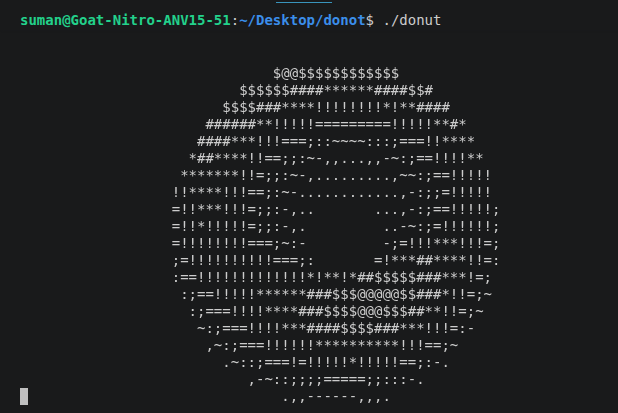

<p align="center">
  
</p>
# The Spinning ASCII Donut — How It Works

A breakdown of the math behind the animation, and the engineering that went into
shaping the source code itself into a donut.

---

## 1. The Core Idea

We're rendering a **torus** (donut shape) in 3D, rotating it, and projecting it
onto a 2D grid of ASCII characters — all without a graphics library, just `printf`.

Three things have to happen every frame:

1. Generate 3D points on the surface of a torus.
2. Rotate that torus in 3D space.
3. Project the rotated 3D points onto a 2D character grid, picking a character
   that represents how lit up that point is.

---

## 2. The One Core Formula

If there's a single formula that *is* the spinning donut, it's this — derived
cleanly in five steps: **shape → rotate → rotate → project → shade**.

### Step 1 — The torus itself (before any rotation)

Two angles do all the work:
- `θ` (theta) — sweeps around the **big circle** (the donut's main loop)
- `i` — sweeps around the **tube's cross-section** (the little circle)

```
x₀ = (R2 + R1·cos i)·cos θ
y₀ = (R2 + R1·cos i)·sin θ
z₀ =  R1·sin i
```

- `R1` = tube thickness (radius of the small circle)
- `R2` = distance from the donut's center to the center of the tube

This is *the* formula that defines "donut shape." Everything below just moves
and displays it.

### Step 2 — Rotate around the X-axis by angle `A`

```
x₁ = x₀
y₁ = y₀·cos A − z₀·sin A
z₁ = y₀·sin A + z₀·cos A
```

### Step 3 — Rotate around the Z-axis by angle `B`

```
x₂ = x₁·cos B − y₁·sin B
y₂ = x₁·sin B + y₁·cos B
z₂ = z₁
```

`A` and `B` increase a little every frame — that's the entire animation.
Nothing else changes per-frame except these two angles.

### Step 4 — Project to the screen

```
D = 1 / (z₂ + K₂)              ← K₂ = viewer distance, keeps things from dividing by zero
screen_x = width/2  + K₁·D·x₂
screen_y = height/2 + K₁·D·y₂
```

`D` doubles as depth for the z-buffer (bigger `D` = closer to viewer = drawn
on top).

### Step 5 — Shading (the normal vector)

The surface normal at any point is just the *unrotated* radial direction on
the tube:

```
n₀ = (cos i · cos θ,  cos i · sin θ,  sin i)
```

Run `n₀` through the **exact same two rotations** as the point (Step 2 + 3)
to get `n₂`, then:

```
luminance = n₂ · light_direction
```

That scalar picks the character from `".,-~:;=!*#$@"`.

The rest of this document (§3 onward) walks through how the actual C code
implements each of these five steps, plus the engineering behind reshaping
the source into a literal donut.

---

## 3. Parametrizing the Torus (as implemented in code)

A torus is a tube swept in a circle. We describe every point on its surface with
two angles:

- **`i`** — angle around the tube's own cross-section (the small circle).
- **`j`** — angle around the donut's central axis (the big circle).

For a tube of radius `1` centered at distance `2` from the origin (`R2 = 2`), a
point on the torus surface before rotation is:

```
circle_x = cos(i) + 2      // R2 + R1*cos(i), R1 = 1
circle_y = sin(i)
```

`circle_x` is the distance from the donut's central axis, and `circle_y` is the
height above/below the donut's equatorial plane. Sweeping `circle_x` around the
big circle by angle `j` gives the full 3D surface point:

```
x = circle_x * cos(j)
y = circle_y
z = circle_x * sin(j)
```

The code loops `i` and `j` each from `0` to `2π` in small steps — that double
loop **is** the torus. Every `(i, j)` pair is one surface point.

---

## 4. Rotating in 3D

The donut spins around two axes at once, controlled by angles `A` and `B`,
incremented every frame (`A += 0.04`, `B += 0.02` — different rates, so it
tumbles rather than just spinning flatly).

Standard 3D rotation matrices are applied:

- Rotate around the **X-axis** by `A` (tips the donut forward/back)
- Rotate around the **Z-axis** by `B` (spins it left/right)

Rather than building explicit matrices, the code inlines the rotation algebra
directly into the per-point calculation — this is the dense block of `sin`/`cos`
terms (`e = sin(A)`, `g = cos(A)`, `m = cos(B)`, `n = sin(B)`, etc.) that
combine to give the final rotated `(x, y, z)`.

---

## 5. Perspective Projection

Once a point's 3D position is known, it needs to become a 2D screen coordinate.
This uses a simple **perspective divide**:

```
K1 = 30                      // "zoom" factor, tuned by eye
D  = 1 / (z + K2)            // K2 = distance of viewer from donut (here folded into the formula as +5)
screen_x = width/2  + K1 * D * x
screen_y = height/2 + K1 * D * y
```

The `1/z`-style term (`D` in the code) is what makes farther points appear
smaller and closer to the center — the same principle that makes railway
tracks converge on the horizon. `D` is also reused as a cheap **depth value**.

---

## 6. Hidden Surface Removal — the Z-Buffer

Multiple points on the torus can map to the *same* character cell on screen
(the far side of the donut is behind the near side). To only draw what's
actually visible, the program keeps a **z-buffer**: one depth value per screen
cell.

```
if (D > zbuffer[cell]) {
    zbuffer[cell] = D;
    buffer[cell]  = shading_character;
}
```

`D` is larger for points closer to the viewer (since `D = 1/distance`), so this
simple comparison always keeps whichever point is nearest the camera for each
cell — a minimal, brute-force version of the z-buffering technique used in real
3D graphics pipelines.

---

## 7. Shading With ASCII

There's no lighting engine here — just a dot product between the surface
normal at each point and a fixed light direction, which is a well-known trick:

```
luminance = normal · light_direction
```

The result is a value roughly from `-1` (facing away from the light) to `1`
(facing directly into it). That's scaled and used as an index into a
brightness ramp:

```
".,-~:;=!*#$@"
```

Characters are ordered from visually "light" (`.`) to visually "dark and dense"
(`@`), so low luminance picks a sparse character and high luminance picks a
dense one — a 12-level grayscale using pure text.

---

## 8. The Render Loop

Each frame:

1. Clear the character buffer and z-buffer.
2. Loop over every `(i, j)` on the torus surface, compute 3D point → rotate →
   project → shade → z-test → write to buffer.
3. Move the cursor home with an ANSI escape (`\x1b[H`) instead of clearing and
   reprinting the whole screen — this avoids flicker.
4. Print the buffer.
5. Increment `A` and `B`, sleep briefly (`usleep`), repeat forever.

That's the entire algorithm — no external libraries beyond `<math.h>`, no
graphics API, just trigonometry and a character array.

---

## 9. Engineering Behind the Donut-Shaped Source File

Writing the algorithm is one thing — making the *source code itself* visually
form a donut, while remaining valid, compilable C, required a separate small
pipeline:

### a) Tokenization, not character-shuffling
The source was parsed into proper C tokens (identifiers, numbers, string/char
literals, operators, punctuation) using a regex tokenizer — critical because:
- String literals like `"\x1b[2J"` and `".,-~:;=!*#$@"` had to stay atomic.
  Splitting them across lines would insert an illegal raw newline into a string.
- Compound operators (`+=`, `==`, `&&`, `->`, etc.) had to be recognized as
  *single* tokens. An earlier version of the tool tokenized `+=` as two
  separate characters, which got separated by a line-wrap and silently changed
  `A += 0.04` into `A + =0.04` — a different (and invalid) program. Fixing this
  meant adding an explicit set of multi-character operators to the tokenizer.

### b) Geometry: rasterizing an annulus
A 2D boolean grid mask was generated by testing each `(x, y)` cell against
the distance from the grid's center:

```python
inner_radius <= distance(cell, center) <= outer_radius
```

Character cells are roughly twice as tall as they are wide, so the `x`
distance was scaled down (`dx / 1.9`) to correct the aspect ratio — otherwise
the "donut" would render as a tall oval instead of a circle.

### c) Constrained packing
Tokens were then packed left-to-right, row-by-row, only into cells where the
mask was "on" (i.e., inside the ring), skipping the "off" cells (the hole and
the outside) entirely. A `needs_space()` function decided when a literal space
had to be inserted between two tokens — e.g., two adjacent word-like tokens
(`int` next to `main`) need a separator, but `)` next to `;` doesn't. This
function also had to guard against **accidentally forming a different
operator** at the seam between two tokens (e.g., placing `+` directly next to
`=` could be silently misread as `+=`), so a check against a table of
compound operators was added to force a space wherever that risk existed.

### d) A subtle but important correctness bug
The first working version accidentally let ordinary code tokens flow onto the
**same visual line** as a `#include` directive, because the packer just kept
filling available space in a row. That's invalid — the C preprocessor requires
directives to occupy their own line. It manifested as a real compiler error
(`extra tokens at end of #include directive`) which then cascaded into a
second, less obvious failure: because the `#include <unistd.h>` line failed to
parse cleanly, `unistd.h` wasn't actually included, so `usleep()` had no
declaration. The fix was two-fold: force every preprocessor line to occupy an
entire row of the mask on its own (no other tokens may share it), and add
`#define _DEFAULT_SOURCE` before including `<unistd.h>` so `usleep` is
declared under strict C standards regardless.

### e) Verification loop
After every change to the packing logic, the generated file was recompiled
with `gcc -Wall` and run through a short, time-boxed execution
(`timeout 0.3s ./donut_shaped`) to diff its animation output against the
original, unshaped program — confirming the visual reshaping never altered
runtime behavior, only source layout.

---

## Summary

| Concern | Technique used |
|---|---|
| 3D shape | Torus parametrized by two angles (`i`, `j`) |
| Motion | Two independent rotation angles (`A`, `B`) updated per frame |
| 3D → 2D | Perspective projection via `1/z` divide |
| Occlusion | Per-cell z-buffer, brute-force nearest-point-wins |
| Shading | Dot product with light vector → 12-level ASCII ramp |
| Flicker-free redraw | ANSI cursor-home escape instead of screen clear |
| Donut-shaped source | Tokenizer-aware constrained packing into a rasterized annulus mask |
| Correctness under reshaping | Atomic string/operator tokens, forced directive line-isolation, compile+run verification after every change |
